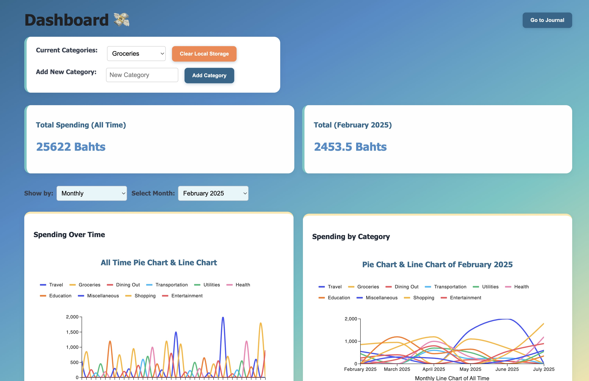
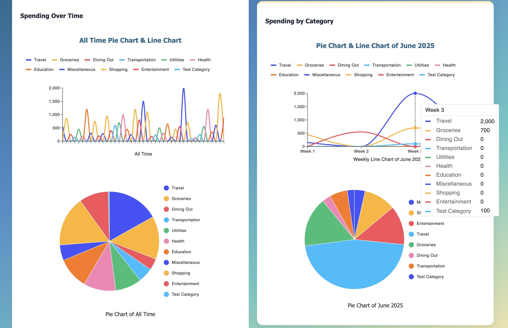
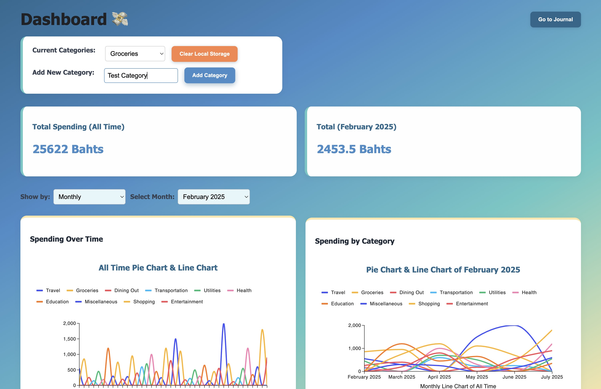
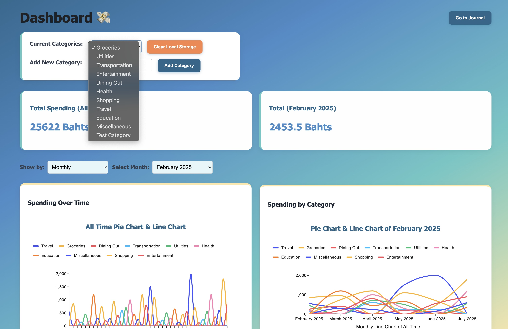
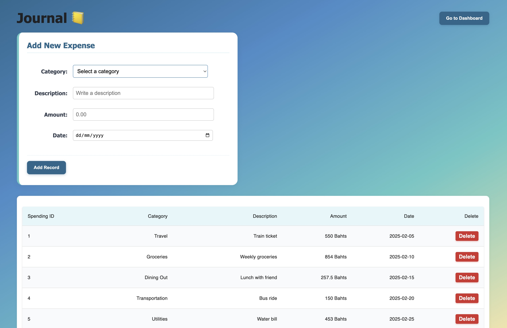
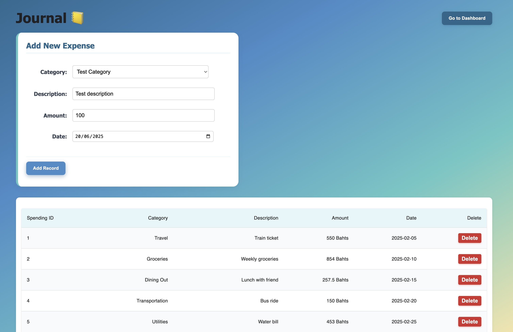
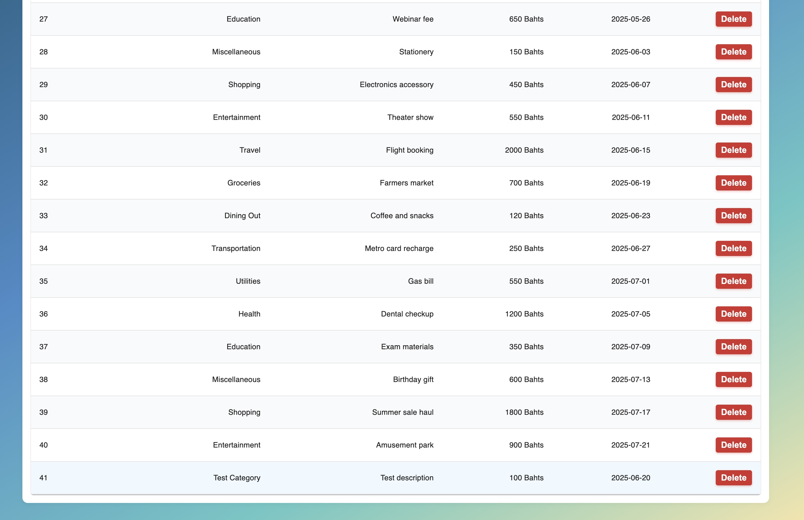
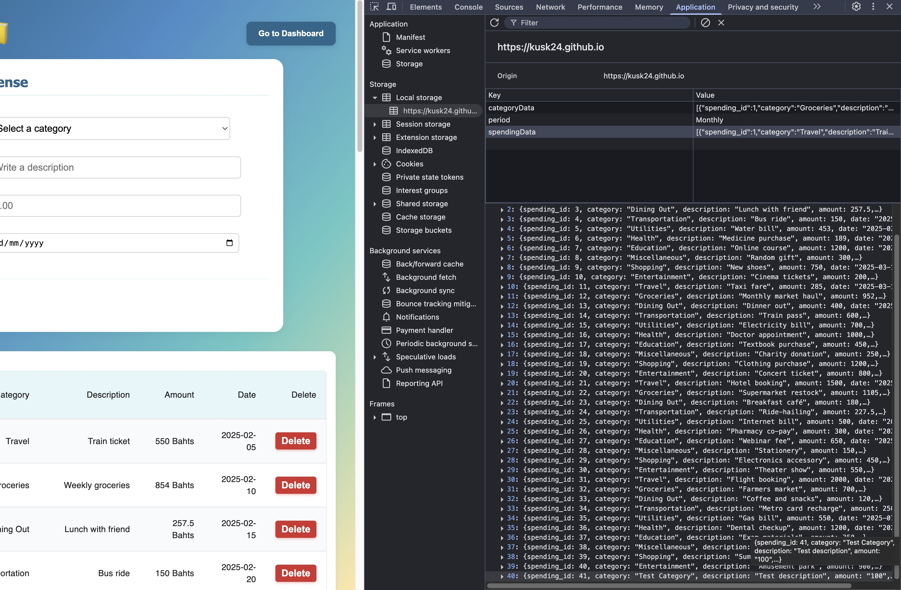

# 💰 Project 01 Spending Tracker Web App

A simple React.js web application that helps users track their spending, visualize expenses with categories — all stored locally using **localStorage**. No backend required!

> 🚀 [Live Demo (GitHub Pages)](https://kusk24.github.io/Project-01-Spending-Tracker/)

---

## 📸 Screenshots

### 📊 Dashboard Overview
Displays analytics with filters (daily/weekly/monthly) and chart visualizations.



### 📈 Charts View
Visualize daily, weekly or monthly spending using a **line chart** and **pie chart**.



### ➕ Add Category
Users can create custom spending categories.



### 📂 List of Categories
Check out categories.



### 📘 Journal Page
The page for entering daily spending records.



### 📝 Add Journal Entry
Input your spending with date, category, and amount.



### 📋 List Journal Entries
Shows a history of recorded expenses.



### 💾 Local Storage Snapshot
All your data is stored persistently in the browser.



---

## 🛠 Features

- ✅ LocalStorage-based persistence
- ✅ Add custom categories
- ✅ Record and view spending history
- ✅ Filter dashboard by day/week/month
- ✅ Charts for spending analysis
- ✅ Responsive design for all devices

---

## 👥 Team Members

- **Win Yu Maung**
- **Sam Yati**
- **Phonvan Deelertpattana**

---

## 🔗 GitHub Links

- **GitHub Repo**: [github.com/Kusk24/Project-01-Spending-Tracker](https://github.com/Kusk24/Project-01-Spending-Tracker)
- **Live Website**: [kusk24.github.io/Project-01-Spending-Tracker](https://kusk24.github.io/Project-01-Spending-Tracker/)

---

## 💻 Run Locally

```bash
git clone https://github.com/Kusk24/Project-01-Spending-Tracker.git
cd Project-01-Spending-Tracker
pnpm install
pnpm run dev